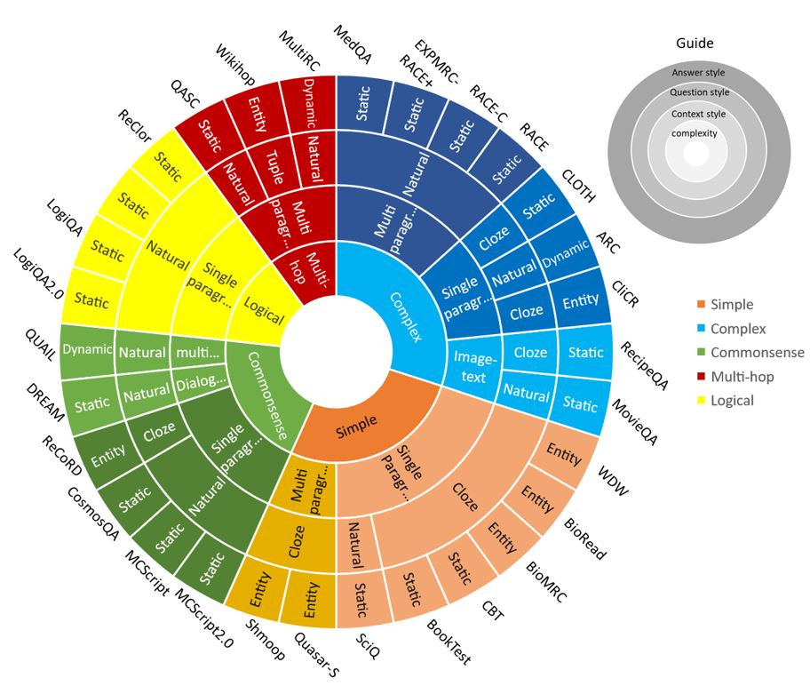

# 📚 Multi-Choice Machine Reading Comprehension Benchmark Datasets: A Survey

[](https://www.sciencedirect.com/science/article/pii/S1568494625018125)
[](LICENSE)
[]()
[]()

> **Shima Foolad, Kourosh Kiani\*, Razieh Rastgoo**  
> Department of Electrical & Computer Engineering, Semnan University, Semnan, Iran  
> \*Corresponding author

---

## 📋 Abstract

Machine Reading Comprehension (MRC) has emerged as a critical area in Natural Language Processing (NLP), especially within the realm of multi-choice and cloze-style tasks that assess a model's ability to understand and reason over text. This paper offers a comprehensive examination of recent developments in multi-choice MRC by analyzing existing cloze-style and multiple-choice benchmark datasets, many of which have been underexplored in the research community.

We introduce a **refined 6-dimensional classification method** based on corpus style, domain, complexity, context style, question style, and answer style. Beyond dataset analysis, we discuss implications for MRC model design, review recent advances in MRC methodologies, and examine prompt-based and instruction-following models.

---

## 📈 Key Figure



*Figure: A chart representing complexity type of the MRC datasets along with other styles of new categories.*

---

## ✨ Highlights

- 📊 **30 benchmark datasets** surveyed — cloze-style and multi-choice
- 🗂️ **Novel 6-dimensional taxonomy** for dataset classification
- 🤖 **SOTA vs. human performance** comparison across all datasets
- 📈 **Full model progression** from BERT → RoBERTa → T5 → GPT-4 / Claude / LLaMA / Gemini
- ✅ **"Solved?" tracking** — identifies datasets where machines have surpassed humans
- 🔗 **Download & leaderboard links** for all publicly available datasets

---

## 📁 Repository Structure

```
mc-mrc-survey/
├── README.md                        # This file
├── datasets/
│   ├── datasets_part1.md            # Table 1 — Multi-choice MRC datasets (2016–2018)
│   ├── datasets_part2.md            # Table 2 — Multi-choice MRC datasets (2019–2023)
│   ├── leaderboards.md              # Download & leaderboard links
├── classification/
│   └── taxonomy.md                  # 6-dimensional classification scheme
├── figures/                         # Paper figures 
└── CONTRIBUTING.md                  # How to contribute updates
```

---

## 📊 Dataset Overview

A quick summary of the 30 datasets covered. See [`datasets/`](datasets/) for full details.

| Scale | Question Size | Examples |
|---|---|---|
| 🔴 Large | > 140k | CBT, BookTest, BioRead, BioMRC, WDW | 
| 🟡 Mid | 40k – 140k | RACE, CliCR, CLOTH, ReCoRD, WikiHop | 
| 🟢 Small | < 40k | DREAM, CosmosQA, ReClor, QuAIL, RULE | 

### Data Source Breakdown

| Source Type | Datasets (Count) |
|---|---|
| 📝 Exam | RACE, CLOTH, DREAM, ReClor, RULE, LogiQA, LogiQA2.0, MedQA, ARC, QASC, SciQ, RACE-C, ExpMRC-RACE+ **(13)** |
| 🌐 Web | Quasar-S, WikiHop, RecipeQA, QuAIL, CliCR, BioRead, BioMRC **(7)** |
| 📰 News | MultiRC, ReCoRD, WDW **(3)** |
| 📖 Book | CBT, BookTest, Shmoop **(3)** |
| 🎭 Story | MCScript, MCScript2.0, CosmosQA, MovieQA **(4)** |

---

## 🤖 Model Performance Summary

Key results from **Table 14** across selected MRC datasets:

| Model | ARC | DREAM | CosmosQA | QASC | ReClor |
|---|---|---|---|---|---|
| 👤 Human | — | 98.6 | 94.0 | 93.0 | 63.0 |
| BERT | 44.6 | 66.8 | 67.3 | 53.1 | 49.8 |
| RoBERTa | 66.4 | 88.9 | 80.8 | 80.0 | 55.6 |
| ALBERT | 62.9 | **90.0** | 79.2 | — | 62.6 |
| T5 | **81.1** | — | **90.2** | **89.5** | — |
| DeBERTa | — | — | 86.8 | 89.3 | 72.7 |
| LLaMA 3.1 8B Instruct | **82.0** | — | — | — | **82.5** |

> **Bold** = best per column. LLaMA 3.1 8B Instruct surpasses human performance on ReClor (63.0% human → 82.5% model).

---

## 🔖 Citation

If you find this survey useful, please cite:

```bibtex
@article{foolad2026mcmrc,
  title     = {Multi-Choice Machine Reading Comprehension Benchmark Datasets: A Survey},
  author    = {Foolad, Shima and Kiani, Kourosh and Rastgoo, Razieh},
  journal   = {Applied Soft Computing},
  year      = {2026},
  publisher = {Elsevier},
  url       = {https://www.sciencedirect.com/science/article/pii/S1568494625018125}
}
```

---

## 🤝 Contributing

Spotted a new dataset, a broken link, or an updated SOTA result?  
Please open an issue or pull request — see [CONTRIBUTING.md](CONTRIBUTING.md) for guidelines.

---

## 📄 License

This repository is licensed under the [MIT License](LICENSE).
