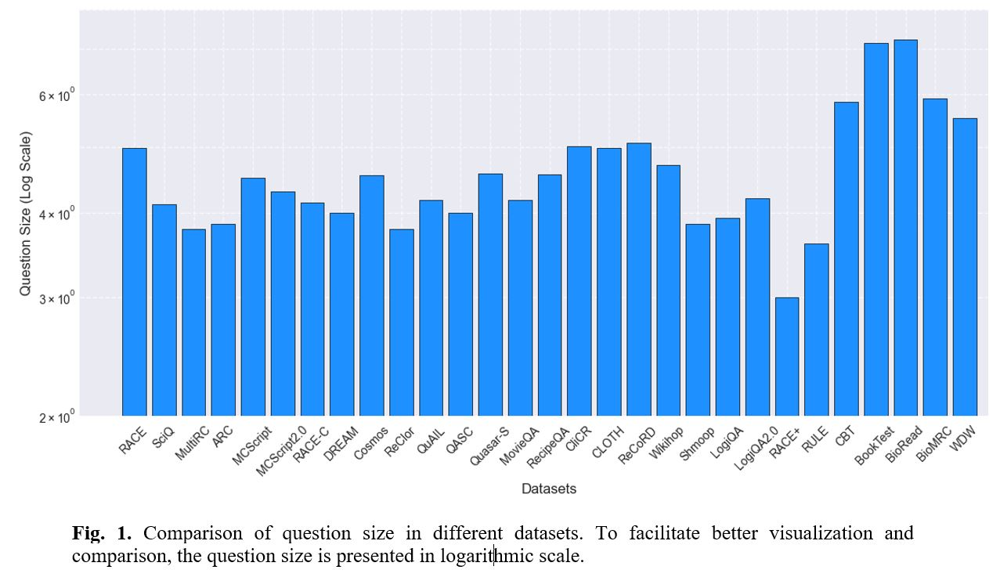
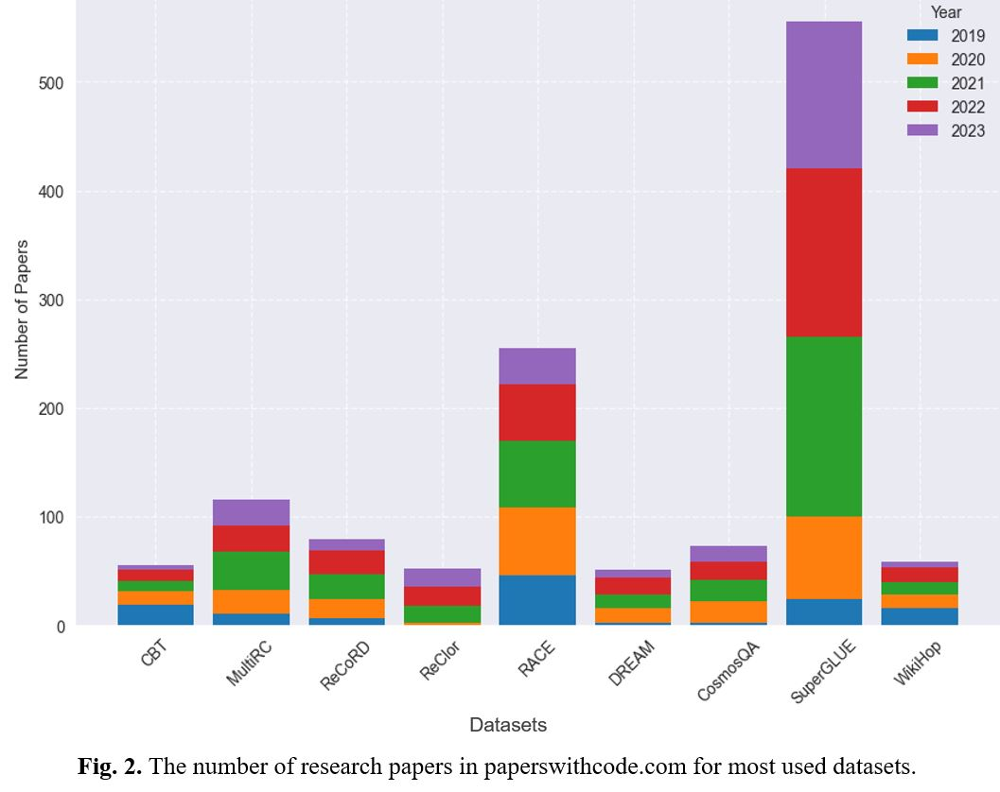
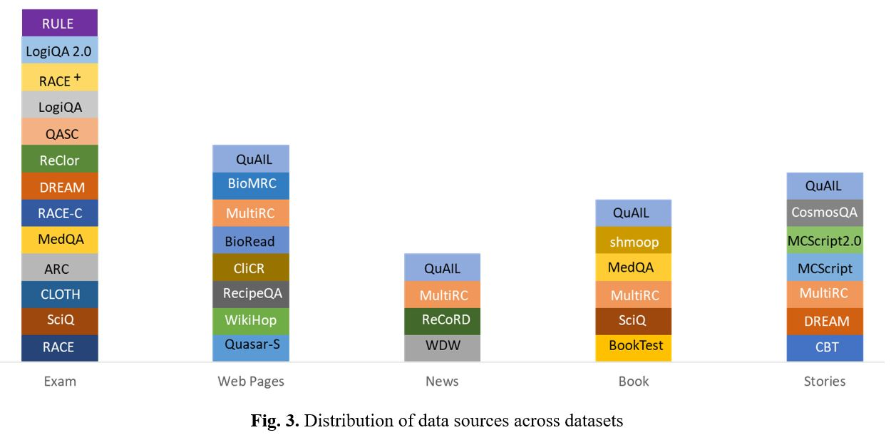
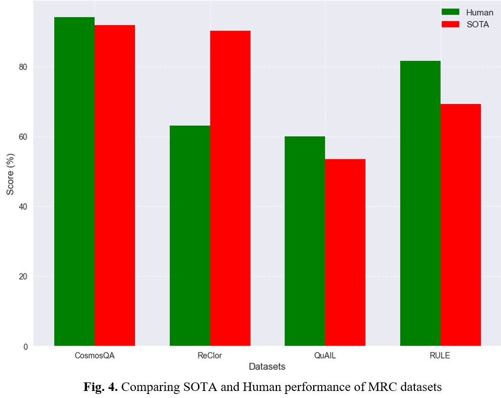
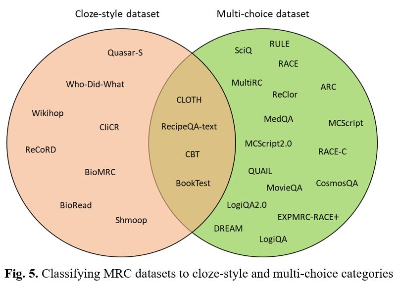
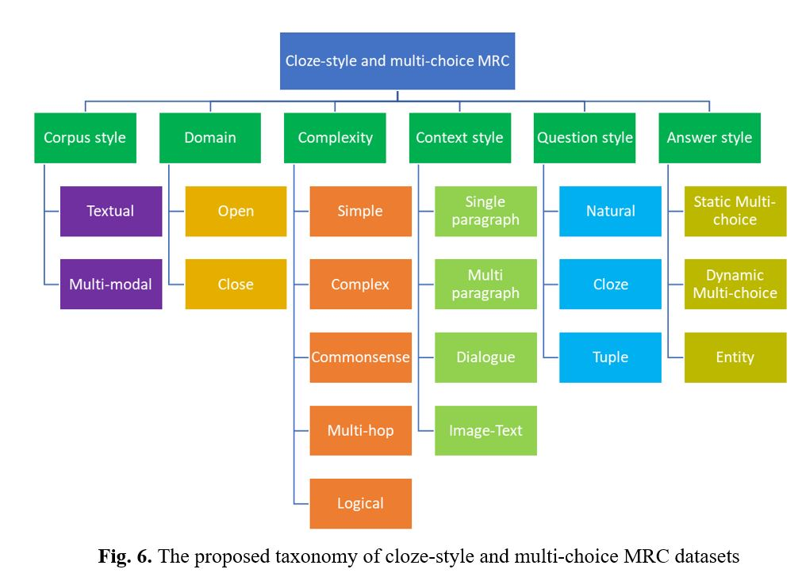
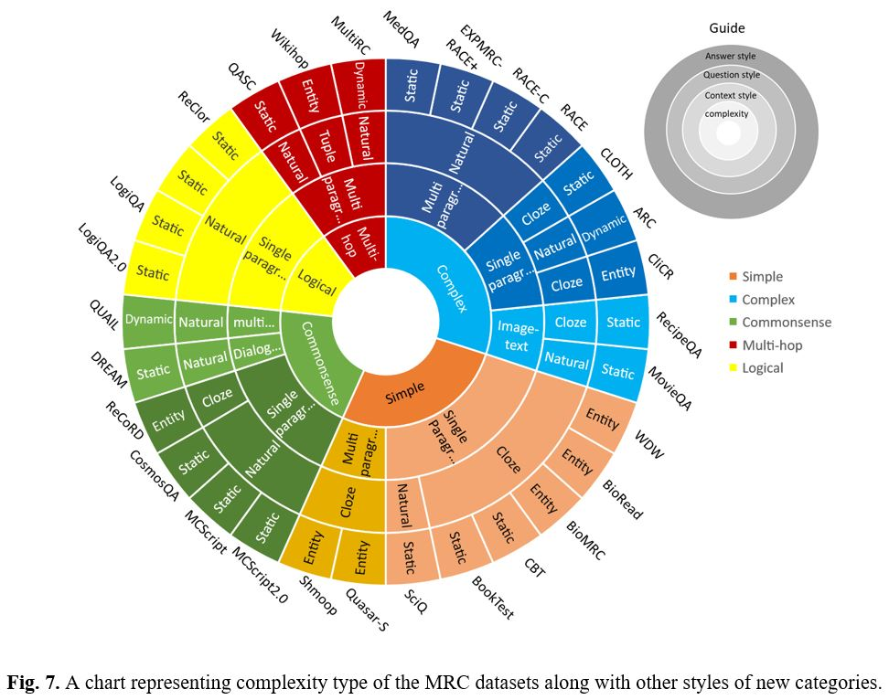
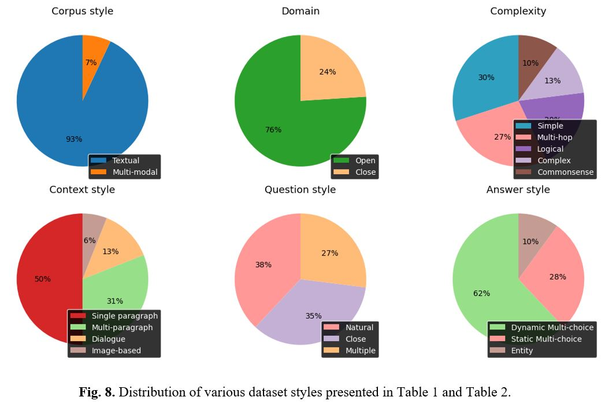

# Figures and Descriptions

## Fig. 1

**Comparison of question size in different datasets.**

To facilitate better visualization and comparison, the question size is presented in logarithmic scale.

## Fig. 2

**The number of research papers in paperswithcode.com for most used datasets.**

## Fig. 3

**Distribution of data sources across datasets**

## Fig. 4

**Comparing SOTA and Human performance of MRC datasets**

## Fig. 5

**Classifying MRC datasets to cloze-style and multi-choice categories**

## Fig. 6

**The proposed taxonomy of cloze-style and multi-choice MRC datasets**

## Fig. 7

**A chart representing complexity type of the MRC datasets along with other styles of new categories.**

## Fig. 8

**Distribution of various dataset styles presented in Table 1 and Table 2.**
